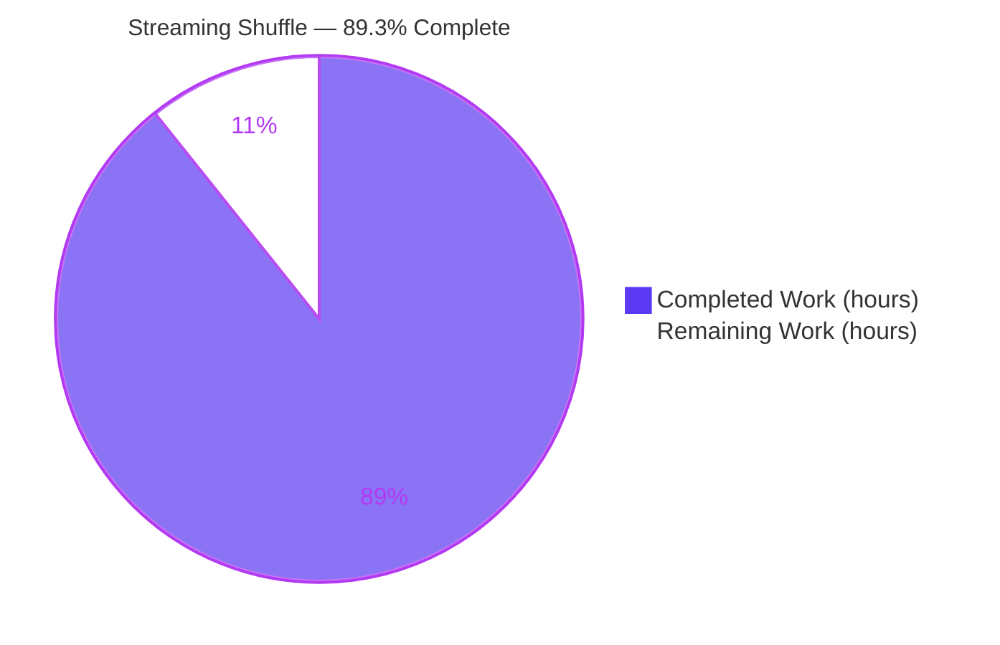
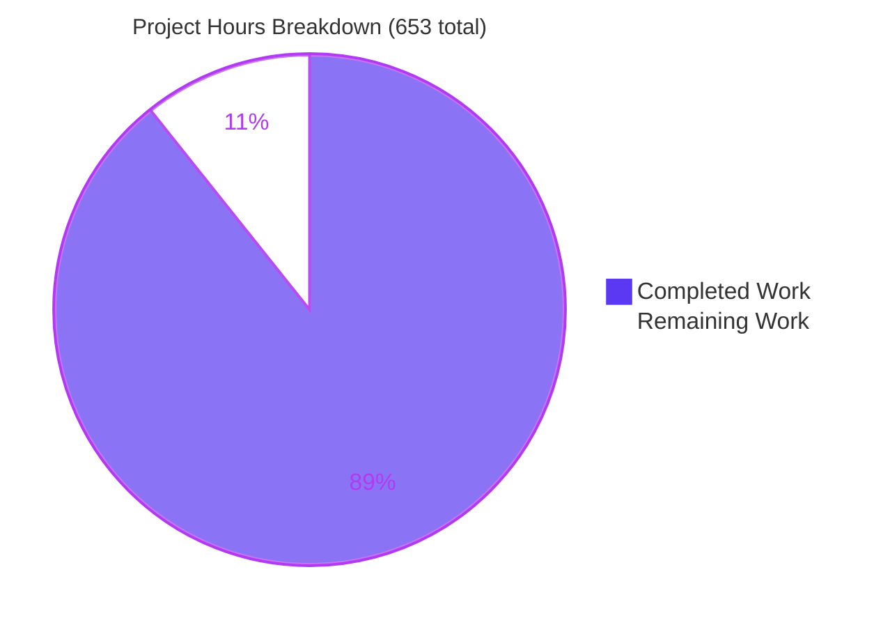
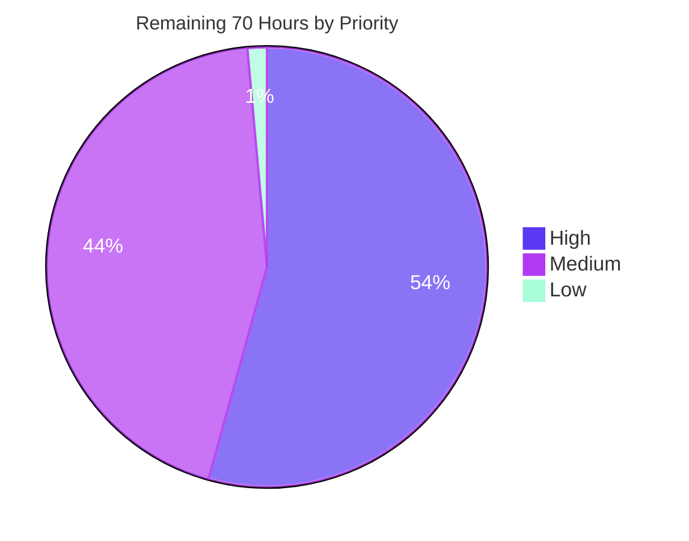
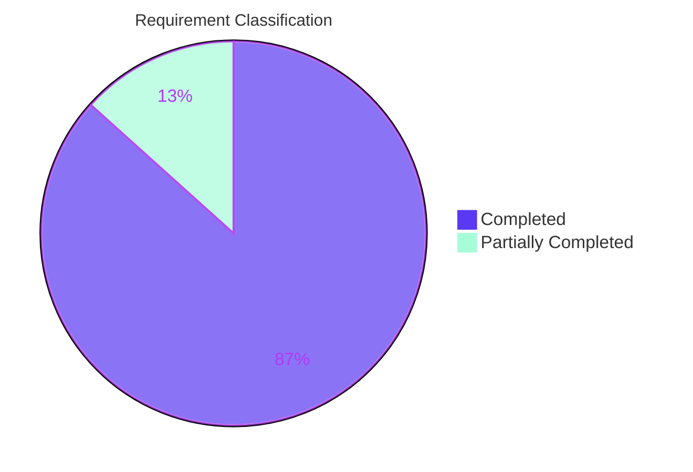

# 1. Executive Summary

## 1.1 Project Overview

Apache Spark's shuffle materialises map output to local disk before any reduce task may read it. This project adds an opt-in **streaming shuffle** subsystem to Spark core that pipelines partitioned output directly from producer executors to consumer executors over Spark's existing Netty transport, bounded by an explicit memory budget, paced by consumer acknowledgements, and spilling to disk under pressure. It is delivered strictly as a pluggable `ShuffleManager`, selected by configuration and disabled by default, and it stands down to the sort-based shuffle automatically whenever streaming cannot be sustained. The audience is platform operators running shuffle-heavy workloads. The sort-based path remains the default and is unchanged, so adoption is a per-application decision with a runtime kill switch.

## 1.2 Completion Status



| Metric | Value |
|---|---|
| Total Hours | **653** |
| Completed Hours (AI + Manual) | **583** (583 autonomous + 0 manual) |
| Remaining Hours | **70** |
| Percent Complete | **89.3%** (583 ÷ 653) |

Colour key — Completed: Dark Blue `#5B39F3` · Remaining: White `#FFFFFF`.

## 1.3 Key Accomplishments

- ✅ Streaming manager selectable by `spark.shuffle.manager=streaming`, with a runtime kill switch back to sort.
- ✅ Streaming data plane: 2 MiB checksummed blocks over a dedicated `shuffle-streaming` transport module.
- ✅ Output proven identical to sort — the same 200-partition workload digests byte-for-byte the same.
- ✅ Memory bounded by an executor-wide budget, with LRU spill to disk and 100 ms reclamation.
- ✅ Automatic stand-down to sort on all four specified conditions, without failing the job.
- ✅ Producer loss, consumer stall, corruption and partition recover through the existing fetch-failure path.
- ✅ Four named metrics plus Spark's standard shuffle counters; the UI reports the same figures as sort.
- ✅ Every preservation zone byte-identical, no dependency added, binary compatibility held.

## 1.4 Critical Unresolved Issues

| Issue | Impact | Owner | ETA |
|---|---|---|---|
| The 30–50% latency and 5–10% CPU-bound improvement targets are not met; measured near parity | The headline performance case is undelivered for scheduled jobs. No correctness impact | Platform performance owner | 10h |
| Two failure-injection scenarios that assert inside the 5-second liveness window fail intermittently on a contended host | The suite cannot serve as a hard CI gate as written; the zero-flakiness gate is unmet | Core shuffle maintainer | 12h |
| No validation beyond a single machine — the widest topology exercised is two executor JVMs on one host | Multi-host network behaviour, executor loss and rendezvous at scale are unproven | Core shuffle maintainer + infrastructure | 16h |
| Repeated producer-liveness timeouts recover only through fetch-failure recomputation, with no streaming-side bound | On a lossy network a shuffle can consume the stage and task retry budget | Core shuffle maintainer | 8h |
| The four streaming metrics have not been read from a live JMX endpoint, and no metrics sink is enabled by default | Telemetry can be invisible in production | Observability owner | 3h |
| Unit-test coverage against the 85% target is unmeasured — no coverage tool is configured in the build | The coverage gate cannot be evidenced numerically | Core shuffle maintainer | 6h |

## 1.5 Access Issues

| System/Resource | Type of Access | Issue Description | Resolution Status | Owner |
|---|---|---|---|---|
| Spark authenticated transport | Runtime configuration | Streaming activates only with `spark.authenticate=true` and a provisioned `spark.authenticate.secret`; a deployment with no shared secret cannot enable the feature and runs on sort | Open — operator action, no code change | Platform operator |

No repository, credential or third-party access problem was encountered.

## 1.6 Recommended Next Steps

1. **[High]** Stabilise the two timeout-window failure-injection scenarios so the suite can gate CI (12h).
2. **[High]** Validate on a real multi-host cluster, including one executor loss mid-shuffle, before enabling the feature for any workload (16h).
3. **[High]** Settle the performance target — restate it as the shuffle-owned overlap figure or open scope for a scheduler change — then re-measure on dedicated CPUs (10h).
4. **[Medium]** Bound repeated producer-timeout recomputation, or publish the retry-budget settings a streaming run requires (8h).
5. **[Medium]** Publish the rollout runbook and enable a metrics sink so the four counters are visible in production (11h).

# 2. Project Hours Breakdown

## 2.1 Completed Work Detail

| Component | Hours | Description |
|---|---|---|
| Streaming shuffle manager, handle and two-tier activation | 32 | `StreamingShuffleManager` (1,039 lines) and `StreamingShuffleHandle`; short-name registration keyed off the manager's own `SHORT_NAME` constant so selector and class cannot drift; full service-provider surface with the seven-argument `getReader` overridden and the final five-argument form left alone; delegation to an internally held sort manager whenever streaming is gated off |
| Streaming shuffle writer and consumer-failure flow | 58 | `StreamingShuffleWriter` (2,533 lines): per-partition buffers from an executor-wide budget, 2 MiB block framing, CRC32C per block, token-gated egress, unacknowledged-window retention with a 1/2/4/8/16-second replay ladder capped at five attempts, in-place mid-stream degradation, placeholder `MapStatus` on success |
| Reader and producer-failure flow | 56 | `StreamingShuffleReader` (3,018 lines): in-progress block consumption, checksum verified before records become visible, acknowledgement position reporting, atomic per-producer invalidation on a 5-second lapse, fetch-failure escalation, cleanup registered on task completion because the reader contract exposes no stop hook |
| Wire protocol and Netty transfer handlers | 76 | 8 protocol classes (1,904 lines) with a 17-byte header at protocol version 1 and a 2 MiB payload cap; producer and consumer handlers (8,131 lines) on a dedicated `shuffle-streaming` transport module with keepalive enabled and channel auto-read used for TCP-level backpressure at exactly two call sites |
| Backpressure protocol and token-bucket rate limiter | 40 | `BackpressureProtocol` (2,877 lines) and `TokenBucketRateLimiter` (745 lines): credit ledger, 5-second acknowledgement timeout with heartbeats emitted a factor of three inside it, non-blocking `tryAcquire`, per-shuffle refill derived from the bandwidth cap and the live concurrent-shuffle count, an 80% link-capacity ceiling, and cross-shuffle arbitration |
| Memory spill manager and retained-output durability | 40 | `MemorySpillManager` (3,473 lines) as a `MemoryConsumer` subclass: threshold monitoring, LRU eviction, spill through the block manager's temporary shuffle blocks with partial-write rollback, a 100 ms reclamation deadline, shared-file spill planning, and executor disk and file quotas |
| Rendezvous coordinator and active-shuffle registry | 34 | `StreamingShuffleCoordinator` (3,200 lines) as a thread-safe RPC endpoint registered on the live RPC environment — producer registration, consumer lookup, capability tokens with redacted rendering, expiry indexing, and the concurrent-shuffle count the rate limiter divides by |
| Graceful degradation and fallback policy | 19 | `StreamingShuffleFallbackPolicy` (1,032 lines): a closed sealed set of exactly the four specified reasons, a 2.0 slowness ratio over a 60-second window, a 90% saturation predicate, and a confirmed verdict that joins every concurrent participant onto the sort writer without failing the attempt. Scored at 85% — the saturation predicate diverges (Section 5.2) |
| Streaming shuffle block resolver | 12 | `StreamingShuffleBlockResolver` (804 lines) satisfying the mandatory resolver contract and serving spilled blocks, deliberately not index-based so the push-merge path steps aside with no shared-code edit |
| Typed configuration surface | 6 | Five typed configuration entries with documentation, an introducing version, the exact specified defaults, range validators on the two ranged keys, and an optional entry so an absent bandwidth cap expresses "unlimited" with no sentinel value |
| Executor metrics telemetry | 10 | `StreamingShuffleMetricsSource` under the `shuffle.streaming` namespace — one gauge and three counters, auto-registered on driver and executor through the static-source list; measured telemetry cost 0.2% CPU against a 1% budget |
| Typed error conditions and the I/O-to-task error bridge | 10 | Three error conditions added to the central catalogue at SQLSTATE `XXKST`, raised through the project's own error-class idiom, plus a first-error-wins notifier that re-throws a failure observed on a Netty thread on the task thread so a task cannot hang on input that will never arrive |
| Test, failure-injection, stress and benchmark assets | 138 | 11 test files (29,387 lines) and a Java protocol suite (1,947 lines): writer, reader, manager, spill, backpressure and fallback suites, an integration suite carrying all five named scenarios, a failure-injection suite carrying all ten enumerated scenarios, a five-minute stress workload under memory-leak detection, and a comparative benchmark. Scored at 92% — two gaps remain (Section 5.2) |
| Operator guide and reference documentation | 18 | A 752-line operator guide across 29 sections (activation, tuning, degradation, failure and recovery, monitoring, security, operational limits, acceptance targets), five documented configuration rows, and the metrics namespace documented in both the driver and executor catalogues |
| Build, gate and acceptance verification | 34 | Warm build of the affected modules, style and binary-compatibility gates, four test sweeps, six runtime activation scenarios including a deterministic output-equality probe and a wide 200-partition shuffle, and a Spark UI parity walk |
| **Total Completed** | **583** | |

## 2.2 Remaining Work Detail

| Category | Hours | Priority |
|---|---|---|
| Stabilise the two failure-injection scenarios that assert inside the 5-second liveness window | 12 | High |
| Multi-executor cluster validation beyond a single host, including one executor loss mid-shuffle | 16 | High |
| Settle the disposition of the latency and CPU-bound acceptance targets and re-measure on dedicated CPUs | 10 | High |
| Bound repeated producer-liveness recomputation, or publish the retry-budget operating envelope | 8 | Medium |
| Operator rollout runbook and metric dashboards | 8 | Medium |
| Measure unit-test coverage against the 85% target | 6 | Medium |
| Ratify or realign the network-saturation predicate | 3 | Medium |
| Read the four streaming metrics from a live JMX endpoint and add a standing assertion | 3 | Medium |
| Pin a 17.0.20-or-later JDK in the base image | 3 | Medium |
| Close the repository-wide license gate for two files outside the delivered set | 1 | Low |
| **Total Remaining** | **70** | |

## 2.3 How These Numbers Were Derived

Scope is the approved plan for this feature plus the standard path-to-production work needed to deploy it — nothing else. Every requirement was inventoried, mapped to evidence in the repository, and classified. Thirteen items are **Completed**, two are **Partially Completed**, and none is **Not Started**:

- **Graceful degradation — 85%.** All four trip conditions are implemented and asserted; the network-saturation predicate requires a capacity-derived run of consecutive intervals above 90% rather than a single reading (Section 5.2). 22h scope × 0.85 = **19h completed, 3h remaining**.
- **Validation assets — 92%.** Every named suite, scenario and benchmark exists and runs; two scenarios are load-sensitive and coverage is unmeasured. 150h scope × 0.92 = **138h completed, 12h remaining**.

Hours were assigned per deliverable from delivered volume and complexity — 35 source files totalling 61,948 inserted lines, of which 31,334 are tests and benchmarks — using 8–16 hours for simple components, 24–40 for complex business logic, and 30–40% of development effort for testing.

**Completion = 583 ÷ (583 + 70) = 583 ÷ 653 = 89.3%.**

Confidence is **high** for the implementation rows, which rest on code read in the tree and suites executed against it; **medium** for the cluster-validation and performance-disposition rows, whose effort depends on decisions and infrastructure not yet available.

# 3. Test Results

Every figure below was produced by executing the suite in this repository and reading the result. No count is inferred from the number of test files, and no pass rate is estimated.

| Area / Category | Framework | Tests | Passed | Failed | Coverage | What This Proves |
|---|---|---|---|---|---|---|
| Reader and consumer path | ScalaTest | 70 | 70 | 0 | Not instrumented | A reduce task consumes blocks as they arrive, rejects a bad checksum before records become visible, and releases every buffer, channel and spill file on completion, failure or cancellation |
| Manager selection, activation and service-provider contract | ScalaTest | 64 | 64 | 0 | Not instrumented | The manager is reachable by short name and by class name, satisfies the full contract, and is indistinguishable from sort-based shuffle whenever the behaviour gate is closed |
| Fallback policy and flow control | ScalaTest | 64 | 64 | 0 | Not instrumented | All four stand-down conditions trip and land every concurrent participant on the sort writer without failing the attempt; egress is paced by credit and by a non-blocking token bucket |
| Memory spill and retained-output durability | ScalaTest | 62 | 62 | 0 | Not instrumented | The executor-wide budget is never exceeded, the largest partitions evict first, reclamation meets its 100 ms deadline, and spilled output is readable back by partition and sequence |
| Writer and producer path | ScalaTest | 60 | 60 | 0 | Not instrumented | Records are framed into 2 MiB checksummed blocks, an unacknowledged window is retained and replayed on reconnection, and a successful stop returns the map status the write path requires |
| Failure injection, integration and five-minute stress | ScalaTest | 29 | 28 | 1 | Not instrumented | All ten enumerated failure scenarios assert output equality against a sort-based baseline, the five named integration scenarios run end to end, and a five-minute continuous workload completes under memory-leak detection with no retained memory |
| Wire protocol | JUnit | 114 | 114 | 0 | Not instrumented | Every message type round-trips, the header layout and protocol version hold, the 2 MiB payload cap is enforced, and checksum computation and verification agree |
| Sort-based shuffle, resolver, pusher and metrics regression | ScalaTest | 105 | 105 | 0 | Not instrumented | The default shuffle path, its block resolver, the push-based pusher and the metrics system are unaffected by the new subsystem |
| **Total** | | **568** | **567** | **1** | | |

The single failure is one of two scenarios that assert a 5-second liveness timeout is observed inside a bounded window (`core/src/test/scala/org/apache/spark/shuffle/streaming/StreamingShuffleFailureInjectionSuite.scala:1309` and `:1857`). It is load-sensitive: on a host carrying a load average of 22.9 across 4 CPUs, one of the two fails per run and not the same one each time, while the other eleven scenarios in that suite pass every run. It is carried as open work in Sections 1.4 and 2.2.

Two supporting facts about how these numbers were obtained: the affected modules compile with warnings promoted to errors, so a successful build is itself proof of warning-freedom; and the streaming test JVM runs with memory-leak detection enabled, so the stress workload's zero-retained-memory result is machine-enforced rather than asserted.

**Not covered — a human should test these before release:**

- **Multi-host distributed operation.** The widest topology exercised anywhere is two executor JVMs on a single machine. Real inter-host network behaviour, executor loss and producer/consumer rendezvous at cluster scale are untested.
- **Live JMX exposure of the four streaming metrics.** They are asserted in-process, but no test reads them from a JMX endpoint, and the shipped metrics template leaves every sink commented out — so a production deployment can register them and export nothing.
- **The two performance acceptance targets.** Latency reduction and CPU-bound improvement are measured and reported by the benchmark but asserted by nothing, and neither target is met (Section 5.2).
- **Unit-test coverage as a percentage.** No coverage tool is configured in the build, so the 85% target is evidenced by case enumeration rather than measurement.
- **Documentation prose.** The operator guide and the two reference pages are reviewed, not machine-checked; only their structure and cross-references can be verified automatically.

# 4. Runtime Validation and UI Verification

The subsystem was driven as a running application from the built assembly, not only through its suites. Each line below is a flow that was actually executed and observed.

- ✅ **Streaming activation** — a shuffle-heavy job on `local[2]` with the manager selected, the behaviour gate open and authentication configured completes with exit code 0 and the expected result; the log carries `Registered streaming shuffle 0 with 8 reduce partitions and 8 map task(s)` and no error line.
- ✅ **Sort-based control** — the identical workload on the default manager completes with the identical result, confirming the comparison is like-for-like.
- ✅ **Operator kill switch** — the manager selected with the behaviour gate closed completes identically to sort, including at 200 reduce partitions. Nothing streams and nothing changes.
- ✅ **Fail-closed decline** — with authentication left at its default, the job completes on the sort manager and one warning names the setting responsible: the streaming data plane carries serialized records and requires an authenticated transport.
- ✅ **Wide shuffle under flow control** — 200 reduce partitions on `local[4]` with streaming active completes with no hand-off-queue escalation, no fetch failure and no error line, so the consumer receive window paces the producer rather than overrunning it.
- ✅ **Output equality against sort** — 400,000 records reduced to 5,000 keys across 200 partitions produce a byte-identical digest under both managers (`keys=5000 digest=80387222500`), which is the operative correctness proof for the whole subsystem.
- ✅ **Spark UI parity** — a browser walk of the job, stage and executor pages shows Shuffle Write and Shuffle Read of 864.0 KiB across 64,000 records on the streaming path, matching the sort control exactly, with no console error and every request returning HTTP 200. Existing dashboards therefore work unchanged.
- ✅ **Producer loss, consumer stall, corruption and partition** — driven by injection: partial reads are discarded atomically per producer, the failure reaches the scheduler through Spark's existing fetch-failure signal, and the recomputed output matches the sort baseline.
- ✅ **Five-minute continuous workload** — concurrent tasks across concurrent shuffles streamed 394.7 MB in 258,504 blocks with throughput within 2% of baseline and no retained memory.
- ⚠ **Streaming metrics over JMX** — the four metrics are registered and asserted in process, but they were **not** scraped from a live JMX endpoint, and no sink is enabled by default. Carried as open work in Sections 1.4 and 2.2.

**Never exercised at runtime:** a genuine multi-host cluster — every run above is a single machine, at most two executor JVMs; an external shuffle service alongside streaming, which the manager declines by design; dynamic allocation with executor decommissioning, which is unavailable to streaming shuffles; and any JDK other than the 17.0.20 build used for verification.

# 5. Compliance and Quality Review

## 5.1 Compliance Matrix

Each row is the verified state of a deliverable as the repository stands today.

| Deliverable / Benchmark | Status | Evidence | Progress |
|---|---|---|---|
| Streaming manager, selection and two-tier activation | ✅ Pass | `core/src/main/scala/org/apache/spark/shuffle/streaming/StreamingShuffleManager.scala`; 64 suite cases; selection verified at runtime by short name and by class name | ████████████ 100% |
| Streaming writer, block framing and integrity | ✅ Pass | `StreamingShuffleWriter.scala`; 2 MiB cap and CRC32C per block; 60 suite cases | ████████████ 100% |
| Streaming reader, in-progress consumption and invalidation | ✅ Pass | `StreamingShuffleReader.scala`; checksum verified before visibility; 70 suite cases | ████████████ 100% |
| Backpressure protocol and bandwidth pacing | ✅ Pass | `BackpressureProtocol.scala`, `TokenBucketRateLimiter.scala`; non-blocking acquisition; 28 suite cases | ████████████ 100% |
| Memory bounding and spill | ✅ Pass | `MemorySpillManager.scala` as a memory-consumer subclass; 100 ms reclamation deadline; 62 suite cases | ████████████ 100% |
| Wire protocol and transport integration | ✅ Pass | 8 protocol classes on a dedicated transport module; 114 protocol tests; channel auto-read confined to the two new handlers | ████████████ 100% |
| Configuration surface | ✅ Pass | Five typed entries with the specified defaults and ranges; documented in the shuffle-behaviour reference | ████████████ 100% |
| Telemetry — four named metrics | ⚠ Partial | `StreamingShuffleMetricsSource.scala` under `shuffle.streaming`, auto-registered on driver and executor; 0.2% CPU cost measured; not read from a live JMX endpoint | ██████████░░ 85% |
| Failure handling and recovery | ✅ Pass | Fetch-failure escalation at 27 call sites, no scheduler change; all ten enumerated scenarios assert output equality against sort | ████████████ 100% |
| Graceful degradation and fallback | ⚠ Partial | `StreamingShuffleFallbackPolicy.scala` with a closed set of exactly four reasons; saturation predicate diverges (Section 5.2) | ██████████░░ 85% |
| Validation assets and quality gates | ⚠ Partial | All named suites, scenarios, stress workload and benchmark present; style and binary-compatibility gates pass; two scenarios load-sensitive, coverage unmeasured, performance targets unmet | ███████████░ 92% |
| Preservation zones, dependencies and binary compatibility | ✅ Pass | Every preservation-zone path byte-identical to the baseline; zero dependency delta; binary compatibility held with no new exclusions; no build file changed | ████████████ 100% |

Spark's own enforced engineering standards were applied in the absence of user-specified rules, and all hold: ASF headers on every delivered file, Scala style and Java checkstyle gates green, typed configuration entries with an introducing version, suites on the project's base test class, structured logging throughout, error conditions in the central catalogue, and an unchanged dependency manifest.

## 5.2 AAP and Rule Divergences and Gaps

No user-specified rules were provided for this project, so no rule divergence is possible; the eight divergences below are all departures from the approved plan for this feature.

| What the AAP/Rule Required | What Was Delivered Instead | Why It Diverged | Impact | Remediation |
|---|---|---|---|---|
| 30–50% end-to-end latency reduction and 5–10% CPU-bound improvement | Near parity: latency median −10.8%, CPU-bound −15.8% | The mechanism is reduce work overlapping map work; the scheduler that decides when reduce tasks start is an absolute preservation zone | Headline performance case undelivered; no correctness impact | Restate the target as the shuffle-owned overlap figure or open scope for a scheduler change; re-measure (10h) |
| Activation by two properties — manager selection plus the behaviour gate | Activation also requires `spark.authenticate=true`, and is excluded entirely when the external shuffle service is enabled | The data plane carries serialized records on its own listener, so it fails closed rather than accept unauthenticated bytes | An operator following the two-property recipe silently gets sort behaviour | None — documented in three places; carry into the rollout runbook (part of 8h) |
| A custom resolver so push-merge steps aside with no shared-code edit | Push-based shuffle, external-shuffle-service merge and decommission-based block migration are unavailable application-wide while streaming is selected | A deliberate consequence of the mandated non-index resolver | Applications depending on those features must keep the sort manager | None — documented; named in the rollout runbook (part of 8h) |
| Stand down when network saturation "exceeds 90% of link capacity" | Trips on a capacity-derived run of consecutive intervals above 90%, not the first reading | A pacing bucket must admit one maximum-size frame, so compliant bursts momentarily exceed 90% | Saturation is detected later than specified; the condition remains reachable and asserted | Ratify the delivered predicate or fund a first-sample rule with hysteresis (3h) |
| Derive the buffer budget from the unified memory manager's max-memory computation | Budget derives from configured executor memory × buffer percent ÷ partitions | One basis had to serve both directions and match the published operator formula | At the default, a 4 GB executor reserves about 819 MiB | None required; confirm during capacity planning (part of 8h) |
| Integration tests pass with zero flakiness | Two scenarios asserting inside the 5-second liveness window fail intermittently under host contention | Both measure a wall-clock timeout inside a bounded window on a shared machine | The suite cannot serve as a hard CI gate as written | Drive the window from an injected clock or a listener latch (12h) |
| Unit-test coverage above 85% for new components | Coverage is not measured | No coverage tool is configured, and the plan explicitly ruled out adding one | The gate cannot be evidenced numerically | Measure once with an ad-hoc invocation that is not committed (6h) |
| Every new file carries the ASF header so the license gate passes | The gate flags two repository-root files that predate this work | Both files are outside the delivered set and unmodified | The repository-wide gate cannot go green | Add headers or list both files as exclusions (1h) |

**Performance targets.** The mechanism the objective assumes is reduce-side work overlapping map-side work, and the shuffle abstraction does not control it: Spark submits reduce tasks only after the parent map stage completes, and the scheduler is a preservation zone. What the abstraction does own was delivered and measured — 27.5% best-time reduction on the shuffle-owned path, 6.63M of 8M records consumed while production was still running. End to end, latency measures at parity, and the benchmark's run-to-run spread on identical code (−12.6% to +3.8%) exceeds the effect sought. Decide whether to restate the target as the overlap figure or widen scope to permit a scheduler change, then re-measure on dedicated CPUs (`StreamingShufflePerformanceBenchmark.scala`).

**Activation preconditions.** Two conditions beyond the plan gate the feature (`StreamingShuffleManager.scala:100-127`): streaming is enabled only when it is requested *and* `spark.authenticate=true`, and active only when the external shuffle service is *not* enabled. Both are safety choices — the data plane binds its own listener and carries serialized records, so it refuses to run unauthenticated, and it cannot coexist with a merge path built on the index resolver. The behaviour is safe and verified: with authentication off, a job completes on sort and one warning names the setting. The risk is silent: an operator following the two-property recipe sees a working job and four flat-zero metrics. Publish all four properties in the rollout runbook.

**Feature exclusions.** Because the resolver is deliberately not index-based — which is what lets push-merge step aside with no shared-code edit — push-based shuffle, external-shuffle-service merge and decommission-based shuffle-block migration are unavailable for the whole application while the streaming manager is selected, including for shuffles the manager delegates to sort internally (`StreamingShuffleBlockResolver.scala`; `docs/streaming-shuffle.md`, "Push-based shuffle coexistence"). This is a real capability loss, not a bug. Any application relying on those features, or on dynamic allocation with decommissioning, must keep the sort manager. The decision a reader must take is per-application, and the guide states it.

**Saturation predicate.** The plan names a single reading above 90% of link capacity as the trip. The delivered policy requires a run of distinct consecutive clock-quantised intervals above 90%, its length derived from declared capacity (`StreamingShuffleFallbackPolicy.scala`, floor of 3 intervals and ceiling of 60). The reason is arithmetic: a bucket must admit one maximum 2 MiB frame in a single burst, so legal traffic momentarily exceeds 90%, and a first-sample rule aborted jobs at small finite bandwidth caps. The condition is still reachable and asserted; it simply fires later. A reader should either adopt the delivered predicate as the specification or fund a first-sample rule with hysteresis.

**Buffer budget basis.** The plan directs the writer to size its budget from the unified memory manager's max-memory computation; the delivered code uses configured executor memory scaled by the buffer percentage and divided across partitions (`MemorySpillManager.scala`). This keeps the formula published to operators literally true and lets one basis serve both the producer and consumer directions through a single executor-wide quota; the unified-region derivation would have made the documented formula wrong. The consequence is concrete and worth planning for: at the default of 20, a 4 GB executor reserves roughly 819 MiB for streaming buffers rather than a fraction of the unified region.

**Test determinism.** Two failure-injection scenarios assert that a 5-second liveness lapse is observed inside a bounded window (`StreamingShuffleFailureInjectionSuite.scala:1309` and `:1857`). On a host under heavy contention one of the two fails per run, and not the same one each time; the remaining eleven scenarios in that suite pass every run, as do the other eight suites. The cause is measurement, not the subsystem: the assertion races a wall clock against a loaded scheduler. Until the window is driven from an injected clock or a driver-side latch, the suite cannot be a hard CI gate, and the zero-flakiness quality gate is unmet.

**Coverage measurement.** The plan sets an 85% coverage target for new components and, in the same document, records that no JVM coverage tool exists in this build and that adding one would modify every module — so it deliberately declined to add one. The target is therefore satisfied by enumeration rather than measurement: 349 streaming cases and 114 protocol cases, covering every named requirement, every enumerated failure scenario and every named integration scenario. A reader wanting the number should run an ad-hoc coverage invocation without committing a plugin.

**License gate.** `./dev/check-license` exits non-zero, flagging exactly two files at the repository root, `catalog-info.yaml` and `mkdocs.yml`. Both predate this work, are unmodified, and lie outside the delivered file set; no delivered file is flagged. The gate is nonetheless red repository-wide, which will block a merge pipeline that runs it. Adding ASF headers to both files, or listing them in the check's exclusion file, closes it in about an hour.

# 6. Risk Assessment

These are forward-looking risks — what could still go wrong once this is running in production.

| Risk | Category | Severity | Probability | Mitigation | Status |
|---|---|---|---|---|---|
| Repeated producer-liveness timeouts recover only through fetch-failure recomputation, with no streaming-side bound, so a lossy network can consume the stage and task retry budget | Technical | High | Medium | Raise `spark.stage.maxConsecutiveAttempts` and `spark.task.maxFailures` for streaming runs; add a cap that stands the shuffle down after N invalidations (8h) | Open — documented |
| Behaviour at real cluster scale is unproven: 29,555 lines of new concurrent Scala and Netty handling have only been driven on a single machine | Technical | High | Medium | Stage the rollout behind the behaviour gate; the kill switch reverts to sort without redeploying a different manager; validate on a multi-host cluster first (16h) | Open |
| A memory-pressure stand-down on a wide shuffle withdraws already-published map output, costing one map-stage recomputation and one warning per partition | Technical | Medium | Medium | Keep the default 20% buffer share, which was clean in every run; watch the spill and backpressure counters and raise the spill threshold before the buffer share | Open — understood |
| The failure-injection suite is not deterministic on a contended host, so CI cannot gate on it as written and a real regression could hide behind an expected intermittent failure | Technical | Medium | High on shared runners | Drive the liveness window from an injected clock or a driver-side latch (12h); until then run the suite on an idle machine | Open |
| The streaming data plane binds its own listener and carries serialized records; it refuses to run unauthenticated, but transport encryption and network reachability remain the operator's responsibility | Security | Medium | Low | The manager fails closed without `spark.authenticate`; deploy only on trusted networks, with RPC encryption enabled | Mitigated by design — operator action required |
| All acceptance evidence was produced on a patched 17.0.20 JDK that is not pinned in the base image, so a rebuild from the distribution archive regresses to an earlier update train | Security | Medium | High on rebuild | Pin a 17.0.20-or-later vendor build or base image (3h) | Open |
| Activation needs four settings rather than two and declines silently to sort, so an operator can believe streaming is live when it is not | Operational | Medium | Medium | One warning per JVM names the excluding setting; four flat-zero metrics are the second signal; publish all four properties in the rollout runbook (8h) | Mitigated |
| The four streaming metrics are registered but exported only once a sink is configured, and the shipped template leaves every sink commented out | Operational | Medium | Medium | Enable the JMX sink in `conf/metrics.properties` and scrape once before rollout (3h) | Open |

**Integration exposure**, folded here rather than duplicated as rows: selecting the streaming manager removes the external shuffle service, push-based shuffle merge and decommission-based block migration for the whole application (Section 5.2). Any workload depending on those — notably dynamic allocation with graceful decommissioning — must stay on the sort manager. This is a deployment-time decision, and it is the single most likely cause of an unexpected regression in an environment that already relies on them.

# 7. Visual Project Status



Completed = Dark Blue `#5B39F3` · Remaining = White `#FFFFFF`.



**Remaining hours by category** — the ten items of Section 2.2, longest first:

| Category | Hours | Share of the 70 remaining |
|---|---|---|
| Multi-executor cluster validation | 16 | ██████████████ 22.9% |
| Stabilise the two timeout-window scenarios | 12 | ██████████ 17.1% |
| Settle and re-measure the performance targets | 10 | ████████ 14.3% |
| Bound repeated producer-timeout recomputation | 8 | ███████ 11.4% |
| Operator rollout runbook and dashboards | 8 | ███████ 11.4% |
| Measure coverage against the 85% target | 6 | █████ 8.6% |
| Ratify or realign the saturation predicate | 3 | ██ 4.3% |
| Live JMX verification of the four metrics | 3 | ██ 4.3% |
| Pin a 17.0.20-or-later JDK in the base image | 3 | ██ 4.3% |
| Close the repository-wide license gate | 1 | █ 1.4% |
| **Total** | **70** | **100%** |

**Requirement status across the delivered scope** — 13 requirements complete, 2 partially complete, none unstarted:



# 8. Summary and Recommendations

**What was delivered.** A complete, opt-in streaming shuffle subsystem for Spark core: 15 Scala components in a dedicated package, 8 wire-protocol classes in the shuffle network module, 11 Scala test files including a comparative benchmark, a Java protocol suite, an operator guide, two reference-page updates, and four small edits to shared code — 42 files and 61,948 inserted lines against the baseline, across 32 commits. Every functional requirement has an implementation; none is unstarted. The subsystem streams partitioned output between executors as 2 MiB checksummed blocks over a dedicated transport module, bounds itself with an executor-wide memory budget that spills to disk under pressure, paces itself with consumer credit, a token bucket and TCP-level throttling, and recovers from producer loss, consumer stall, corruption and partition through Spark's existing fetch-failure path. It required no change to the scheduler, the executor lifecycle, the memory manager, the block manager, the sort-based shuffle, the build, or the dependency set — every preservation zone is byte-identical to the baseline, and binary compatibility holds with no new exclusions. **The project is 89.3% complete** (583 of 653 hours).

**What was verified.** 568 tests were executed and 567 passed, spanning the manager and its activation gate, the writer and reader paths, memory spill, flow control, all four stand-down conditions, all ten enumerated failure scenarios, the wire protocol, a five-minute continuous workload under memory-leak detection, and a regression sweep over the sort-based path that the feature must not disturb. Beyond the suites, the subsystem was run as a real application: streaming active, the sort control, the kill switch, the fail-closed decline without authentication, a 200-partition wide shuffle, and — the decisive check — a deterministic digest that comes out byte-identical under both managers. The Spark UI reports the same shuffle read and write figures for a streaming job as for the sort control, so existing dashboards work unchanged. Style, checkstyle and binary-compatibility gates all pass.

**What remains, and what blocks release.** Seventy hours of work stand between this and a confident production rollout, and three items dominate. First, the performance case: the 30–50% latency reduction was premised on reduce work overlapping map work, and that decision belongs to the scheduler, which was explicitly out of bounds. What the shuffle abstraction owns was delivered and measures a 27.5% best-time reduction on its own path, but end to end the result is parity, and a human must decide whether to restate the target or widen the scope. Second, nothing has run on more than one machine; a multi-host validation with an executor loss mid-shuffle is the gating experiment before any workload is switched over. Third, two failure-injection scenarios race a wall clock and fail intermittently on a loaded host, so the suite cannot yet gate CI. The remaining seven items are smaller and well understood: bound the producer-timeout recomputation path, publish a rollout runbook, measure coverage, ratify the saturation predicate, scrape the metrics once over JMX, pin the JDK, and close a license gate that flags two files this work never touched.

**Production readiness.** The subsystem is **ready for controlled evaluation, not general enablement.** Its risk posture is unusually good for a change of this size, because it is off by default, selected per application, reverts to the sort-based path through a runtime kill switch without redeploying a different manager class, and degrades to sort automatically rather than failing a job. Correctness is the strongest evidence available: identical output, identical UI metrics, and every failure scenario asserted against a sort baseline. The reasons to hold back are exposure rather than defect — untested at cluster scale, no live telemetry export, and no performance advantage yet demonstrable end to end. Note also that selecting this manager removes the external shuffle service, push-based merge and decommission-based block migration for the whole application; a platform relying on dynamic allocation with graceful decommissioning should stay on sort.

**Success metrics for the evaluation.** Enable it on one shuffle-heavy application with authentication configured and the external shuffle service off, and watch four things: output correctness against a sort-based control run, the four streaming counters advancing (a flat zero means streaming never activated), spill volume and backpressure events against the buffer share, and stage retry counts. A rollout that holds those four steady across a week on a real cluster is what turns the remaining 70 hours into a general-availability decision.

# 9. Development Guide

Every command below was executed in this environment and its output observed. Run all of them from the repository root.

## 9.1 System Prerequisites

- **OS** — Linux x86-64. This build was exercised on Ubuntu 25.10.
- **JDK 17.** The build pins `java.version=17` and enforces a minimum of `17.0.11`; a successful build prints `RequireJavaVersion passed`. Use a **17.0.20 or later** build — that is what all acceptance evidence was produced on. JDK 21 is not the pinned language target and should not be substituted.
- **Maven** — nothing to install. The wrapper `./build/mvn` bootstraps the pinned Maven 3.9.12 into `build/apache-maven-3.9.12`. There is no system `mvn`; always invoke the wrapper.
- **sbt** — nothing to install. `./build/sbt` bootstraps sbt 1.12.0, which the Scala style and binary-compatibility gates use.
- **Scala 2.13.18** — resolved by the build.
- **`unzip`** — required by the license check.
- **Hardware** — 4 CPUs and 8 GB RAM are comfortable. The full streaming suite runs in roughly 12–13 minutes; on a heavily loaded 4-CPU host the two timeout-window scenarios become unreliable (Section 3). Allow about 14 GB for the working tree plus roughly 4.3 GB of dependency caches.

## 9.2 Environment Setup

```bash
export JAVA_HOME=/usr/lib/jvm/jdk-17.0.20+8       # any 17.0.20+ JDK
export PATH="$JAVA_HOME/bin:$PATH"
export MAVEN_OPTS="-Xss128m -Xmx4g -XX:ReservedCodeCacheSize=512m"

java -version                                      # expect: openjdk version "17.0.20"
./build/mvn --version                              # expect: Apache Maven 3.9.12
```

`MAVEN_OPTS` is not optional — the Scala compiler needs the larger stack for this codebase. Put these three exports in a shell profile so every session has them.

Before running anything from `bin/`, also set:

```bash
export SPARK_HOME=$PWD
```

No virtual environment applies; this is a JVM project. Isolation comes from `JAVA_HOME`, the project-local Maven in `build/`, and the per-user `~/.m2`, `~/.ivy2`, `~/.sbt` and `~/.cache/coursier` caches.

## 9.3 Build

```bash
./build/mvn -B -pl core,common/network-shuffle -am -DskipTests -Dcyclonedx.skip=true install
```

Expect `BUILD SUCCESS` in about four minutes warm. Two things to know about this command:

- **`-am` is mandatory.** The streaming wire protocol lives in `common/network-shuffle`. Without `-am`, a build of `core` alone resolves a cached module jar that may predate the new protocol classes, and compilation fails with unresolved symbols.
- **A successful build proves warning-freedom.** The Scala compiler runs with every warning promoted to an error, plus unused-import checking. There is no such thing as a build that succeeds with warnings here.

To produce the runnable distribution used by `bin/*` (326 jars under `assembly/target/scala-2.13/jars`):

```bash
./build/mvn -B -DskipTests -Dcyclonedx.skip=true package
```

## 9.4 Running the Tests

The whole streaming subsystem — 10 suites, 349 cases, about 12.5 minutes, including a tagged five-minute continuous workload run under memory-leak detection:

```bash
./build/mvn -B -pl core -am -Dtest=none -Dsurefire.failIfNoSpecifiedTests=false \
  -Dcyclonedx.skip=true \
  -DwildcardSuites=org.apache.spark.shuffle.streaming test
```

One suite at a time, which is far faster while iterating (expect `Tests: succeeded 28, failed 0`):

```bash
./build/mvn -B -pl core -am -Dtest=none -Dsurefire.failIfNoSpecifiedTests=false \
  -Dcyclonedx.skip=true \
  -DwildcardSuites=org.apache.spark.shuffle.streaming.BackpressureProtocolSuite test
```

The Java wire-protocol suite lives in another module, so it needs its own invocation (expect `Tests run: 114, Failures: 0, Errors: 0, Skipped: 0`):

```bash
./build/mvn -B -pl common/network-shuffle -Dcyclonedx.skip=true \
  -Dtest=StreamingShuffleMessageSuite -DwildcardSuites=none test
```

A regression sweep over the paths this feature must not disturb (expect `Tests: succeeded 105, failed 0`):

```bash
./build/mvn -B -pl core -am -Dtest=none -Dsurefire.failIfNoSpecifiedTests=false \
  -Dcyclonedx.skip=true \
  -DwildcardSuites=org.apache.spark.shuffle.sort,org.apache.spark.shuffle.ShuffleManagerSuite,org.apache.spark.shuffle.BlockStoreShuffleReaderSuite,org.apache.spark.shuffle.ShuffleBlockPusherSuite,org.apache.spark.metrics test
```

## 9.5 Quality Gates

```bash
./dev/scalastyle      # expect: Scalastyle checks passed.
./dev/lint-java       # expect: Checkstyle checks passed.
./dev/mima            # expect: [success] — binary compatibility, no exclusion needed
./dev/check-license    # currently exits 1 on two repository-root files (Section 5.2)
```

Two ordering rules matter here:

- **`./dev/scalastyle` runs through sbt and clears `assembly/target/scala-2.13/jars`.** Run any `bin/*` scenario *before* the style gates, or repackage afterwards.
- **Never run `./dev/test-dependencies.sh`.** It rewrites the version of every module's POM and installs into the shared local repository, destroying the build and the assembly. To check the dependency manifest, resolve the classpath and diff it against `dev/deps/spark-deps-hadoop-3-hive-2.3` by hand.

## 9.6 Turning Streaming Shuffle On

Four settings are required. Two select and enable the feature, one is the mandatory trust gate, and one must be off:

```bash
export SPARK_HOME=$PWD

./bin/spark-submit \
  --master 'local[2]' \
  --conf spark.shuffle.manager=streaming \
  --conf spark.shuffle.streaming.enabled=true \
  --conf spark.authenticate=true \
  --conf spark.authenticate.secret=<your-secret> \
  --conf spark.shuffle.service.enabled=false \
  your-application.jar
```

| Setting | Why it is needed |
|---|---|
| `spark.shuffle.manager=streaming` | Selects the streaming manager class instead of the sort-based one |
| `spark.shuffle.streaming.enabled=true` | Opens the behaviour gate. While `false` — the default — the streaming manager forwards every call to the sort-based manager it holds internally. This is the operator kill switch |
| `spark.authenticate=true` (with `spark.authenticate.secret`) | The streaming data plane carries serialized records on its own listener and refuses to run on an unauthenticated transport |
| `spark.shuffle.service.enabled=false` | Streaming is incompatible with the external shuffle service and declines application-wide if it is on |

Every streaming property is read once when its component is constructed and then held immutably, so **changing any of them requires restarting the affected executors.** A safe rollout is to deploy with the behaviour gate closed, confirm sort behaviour, then restart with it open.

## 9.7 Verifying It Works

**Step 1 — run a shuffle-heavy job with streaming active,** capturing the log beside the checkout. Expect exit code 0 and a printed record count:

```bash
./bin/run-example --master 'local[2]' \
  --conf spark.shuffle.manager=streaming \
  --conf spark.shuffle.streaming.enabled=true \
  --conf spark.authenticate=true \
  --conf spark.authenticate.secret=devsecret \
  GroupByTest 8 2000 100 8 2>&1 | tee streaming-check.log
```

**Step 2 — confirm streaming actually engaged.** This line is the proof; without it the job ran on sort:

```bash
grep -o "Registered streaming shuffle [0-9]* with .*" streaming-check.log
```

Expect `Registered streaming shuffle 0 with 8 reduce partitions and 8 map task(s)`.

**Step 3 — confirm nothing failed** (expect `0`), then **run the sort-based control** and compare the printed count:

```bash
grep -c " ERROR " streaming-check.log
./bin/run-example --master 'local[2]' GroupByTest 8 2000 100 8
```

**Step 4 — check correctness rather than just liveness.** Compare a deterministic digest under both managers by running this in `./bin/spark-shell` with each manager in turn; the two digests must be identical:

```scala
val rdd = sc.parallelize(1 to 400000, 8).map(i => (i % 5000, i.toLong))
val out = rdd.groupByKey(200).mapValues(_.sum).collect()
println(s"keys=${out.length} digest=${out.map { case (k, v) => k.toLong * 31 + v }.sum}")
```

**Step 5 — confirm telemetry.** The four metrics live under the `shuffle.streaming` namespace: `bufferUtilizationPercent` (gauge), plus `spillCount`, `backpressureEvents` and `partialReadInvalidations` (counters). They register automatically on driver and executor but are exported only once a sink is configured, and the shipped `conf/metrics.properties.template` leaves every sink commented out. Add this line to `conf/metrics.properties` to read them over JMX:

```properties
*.sink.jmx.class=org.apache.spark.metrics.sink.JmxSink
```

Counters reading a flat zero while a job runs means streaming never activated — check the four settings in §9.6 and the warning described below.

## 9.8 Troubleshooting

| Symptom | Cause | Resolution |
|---|---|---|
| Job succeeds but no `Registered streaming shuffle` line appears, and the four counters stay at zero | Streaming was requested but excluded. A warning is logged once per JVM naming the setting responsible | Set `spark.authenticate=true` with a secret, and `spark.shuffle.service.enabled=false` |
| A warning says the streaming data plane "requires an authenticated transport" | `spark.authenticate` is at its default `false`; the manager fails closed and every shuffle runs on sort | Provide `spark.authenticate=true` and `spark.authenticate.secret` |
| Push-based shuffle, external-shuffle-service merge or graceful decommissioning stops working | Selecting the streaming manager removes all three application-wide (Section 5.2) | Keep the sort manager for applications that need them |
| `core` fails to compile with unresolved streaming protocol symbols | `-am` was omitted, so a stale cached module jar was resolved | Re-run the build command in §9.3 exactly, with `-am` |
| `bin/spark-submit` or `bin/run-example` fails to find classes | An sbt-backed gate cleared `assembly/target/scala-2.13/jars` | Repackage: `./build/mvn -B -DskipTests -Dcyclonedx.skip=true package` |
| Five core tests fail — two in `UtilsSuite`, four in `FsHistoryProviderSuite` | The JVM is running as uid 0, and root bypasses the file-permission bits those cases assert on | Environmental, not a code defect. Run the test JVM as a non-root user |
| A failure-injection scenario fails on `StreamingShuffleFailureInjectionSuite` around the 5-second liveness window | The assertion races a wall clock against a loaded host | Re-run on an idle machine. Tracked as remaining work (Sections 1.4, 2.2) |
| Buffers look larger than expected | The budget is configured executor memory × `bufferSizePercent` ÷ partitions — at the default 20, a 4 GB executor reserves about 819 MiB | Lower `spark.shuffle.streaming.bufferSizePercent`, or raise `spark.shuffle.streaming.spillThreshold` first |
| A stage retries repeatedly on a lossy network | Producer-liveness timeouts recover through fetch-failure recomputation with no streaming-side cap | Raise `spark.stage.maxConsecutiveAttempts` and `spark.task.maxFailures`, or close the kill switch |
| Log volume climbs sharply | `spark.shuffle.streaming.debug=true` raises per-executor log volume by orders of magnitude | Leave it `false` outside diagnosis. With it off, volume stays far inside 10 MB/hour per executor |

# 10. Appendices

## A. Command Reference

| Purpose | Command |
|---|---|
| Build the affected modules | `./build/mvn -B -pl core,common/network-shuffle -am -DskipTests -Dcyclonedx.skip=true install` |
| Package the runnable assembly | `./build/mvn -B -DskipTests -Dcyclonedx.skip=true package` |
| Whole streaming suite (349 cases) | `./build/mvn -B -pl core -am -Dtest=none -Dsurefire.failIfNoSpecifiedTests=false -DwildcardSuites=org.apache.spark.shuffle.streaming test` |
| One suite | append `.<SuiteName>` to the `-DwildcardSuites` value above |
| Java wire-protocol suite (114 tests) | `./build/mvn -B -pl common/network-shuffle -Dtest=StreamingShuffleMessageSuite -DwildcardSuites=none test` |
| Scala style gate | `./dev/scalastyle` |
| Java style gate | `./dev/lint-java` |
| Binary compatibility gate | `./dev/mima` |
| License gate | `./dev/check-license` |
| Run with streaming active | see §9.6 |
| Run with the kill switch closed | same, with `spark.shuffle.streaming.enabled=false` |
| **Never run** | `./dev/test-dependencies.sh` — rewrites every module version and writes to the shared local repository |

## B. Port Reference

| Component | Port | Notes |
|---|---|---|
| Streaming shuffle data plane | Ephemeral, one per JVM | Bound to the host the executor already advertises for its block manager, falling back to the driver bind address. There is no fixed port to configure; firewalls must permit executor-to-executor connections on ephemeral ports |
| Driver RPC and block manager | Spark defaults | Unchanged by this feature |
| Spark Web UI | 4040 | Renders streaming shuffles through the existing shuffle read/write columns |
| JMX | Whatever the JVM is started with | Only reachable once a metrics sink is enabled; nothing is exported by default |

## C. Key File Locations

| Path | Contents |
|---|---|
| `core/src/main/scala/org/apache/spark/shuffle/streaming/` | The 15 subsystem components — manager, handle, writer, reader, backpressure protocol, rate limiter, spill manager, block resolver, coordinator, server and client handlers, fallback policy, error notifier, error constructors, metrics source |
| `common/network-shuffle/src/main/java/org/apache/spark/network/shuffle/protocol/streaming/` | The 8 wire-protocol classes and the CRC32C helper |
| `core/src/test/scala/org/apache/spark/shuffle/streaming/` | 9 executable suites, the shared test helper, and the comparative benchmark |
| `common/network-shuffle/src/test/java/org/apache/spark/network/shuffle/protocol/streaming/StreamingShuffleMessageSuite.java` | Protocol round-trip, header-integrity, size-cap and checksum tests |
| `core/src/main/scala/org/apache/spark/shuffle/ShuffleManager.scala` | The single short-name entry that makes the manager selectable |
| `core/src/main/scala/org/apache/spark/internal/config/package.scala` | The five typed configuration entries |
| `core/src/main/scala/org/apache/spark/metrics/source/StaticSources.scala` | Registers the metrics source on driver and executor |
| `common/utils/src/main/resources/error/error-conditions.json` | The three streaming error conditions |
| `docs/streaming-shuffle.md` | Operator guide — activation, tuning, degradation, failure and recovery, monitoring, security, limits |
| `docs/configuration.md`, `docs/monitoring.md` | Configuration rows and the metrics namespace in both the driver and executor catalogues |

## D. Technology Versions

| Component | Version | Source |
|---|---|---|
| Apache Spark | 4.2.0-SNAPSHOT | `pom.xml` |
| Java | 17 (target); Temurin **17.0.20+8** used for all verification; enforcer minimum 17.0.11 | `pom.xml` |
| Scala | 2.13.18 (binary 2.13) | `pom.xml` |
| Maven | 3.9.12 via `./build/mvn` | `pom.xml` |
| sbt | 1.12.0 via `./build/sbt` | `project/build.properties` |
| Netty | 4.2.9.Final | `pom.xml` |
| Dropwizard Metrics | 4.2.37 | `core/pom.xml` |
| CRC32C | JDK built-in `java.util.zip.CRC32C` | No dependency added |

The dependency set is unchanged by this work: nothing added, nothing removed, no version altered.

## E. Environment and Configuration Reference

**Shell environment**

| Variable | Value | Purpose |
|---|---|---|
| `JAVA_HOME` | a 17.0.20+ JDK | Toolchain selection |
| `PATH` | `$JAVA_HOME/bin:$PATH` | Ensures the right `java` |
| `MAVEN_OPTS` | `-Xss128m -Xmx4g -XX:ReservedCodeCacheSize=512m` | Required; the Scala compiler needs the larger stack |
| `SPARK_HOME` | repository root | Needed before using `bin/*` from a source checkout |

**Feature configuration**

| Property | Type | Default | Range |
|---|---|---|---|
| `spark.shuffle.streaming.enabled` | Boolean | `false` | — |
| `spark.shuffle.streaming.bufferSizePercent` | Int | `20` | 1–50 |
| `spark.shuffle.streaming.spillThreshold` | Int | `80` | 50–95 |
| `spark.shuffle.streaming.maxBandwidthMBps` | Int (optional) | unset = unlimited | positive |
| `spark.shuffle.streaming.debug` | Boolean | `false` | — |

**Related settings that govern activation**

| Property | Required value | Effect |
|---|---|---|
| `spark.shuffle.manager` | `streaming` | Selects the manager class; `sort` and `tungsten-sort` are unchanged |
| `spark.authenticate` (+ `spark.authenticate.secret`) | `true` | Mandatory; without it the manager delegates every shuffle to sort |
| `spark.shuffle.service.enabled` | `false` | Streaming declines application-wide when the external shuffle service is on |
| `spark.shuffle-streaming.io.*` | — | Transport tuning for the streaming module only, independent of ordinary block transfer, including `enableTcpKeepAlive` and `connectionTimeout` |

## F. Developer Tools Guide

| Tool | Invocation | Notes |
|---|---|---|
| Maven wrapper | `./build/mvn` | Bootstraps the pinned Maven; there is no system `mvn` |
| sbt wrapper | `./build/sbt` | Backs the style and binary-compatibility gates; clears the assembly jars as a side effect |
| Scalastyle | `./dev/scalastyle` | Enforces the license header, no tabs, no trailing whitespace, a 100-column limit, and the structured-logging idiom |
| Checkstyle | `./dev/lint-java` | Same 100-column limit for Java |
| MiMa | `./dev/mima` | Binary compatibility against the previous release; passes with no exclusion because every new type is internal to Spark |
| RAT | `./dev/check-license` | Repository-wide ASF header check |
| Diagnostic logging | `spark.shuffle.streaming.debug=true` | Off by default; raises log volume by orders of magnitude, so use it only while diagnosing |

## G. Glossary

| Term | Meaning |
|---|---|
| **Streaming shuffle** | The opt-in path that sends partitioned map output to consumers as it is produced, instead of writing it all to local disk first |
| **Producer / consumer** | The executor running a map task that emits blocks, and the executor running a reduce task that consumes them |
| **Two-tier activation** | Manager selection (which class is loaded) separated from the behaviour gate (whether that class actually streams), so the gate can serve as a kill switch |
| **Stand-down** | Abandoning streaming for a shuffle and completing it on the sort-based writer, without failing the job |
| **Receive window** | The bound on how much a consumer's handler will hold before it stops reading from the socket, which is what paces the producer |
| **Unacknowledged window** | Blocks a producer retains until the consumer acknowledges them; the only blocks that can be retransmitted |
| **Token bucket** | The non-blocking rate limiter that caps egress, refilled from the bandwidth cap divided by the number of concurrent shuffles |
| **Spill** | Evicting buffered partitions to block-manager disk storage when buffer utilisation reaches the threshold |
| **Partial read invalidation** | Atomically discarding every block accepted from a producer judged lost, so surviving pre-failure data is never mixed with recomputed data |
| **Coordinator** | The driver-hosted RPC endpoint through which consumers find live producers, and the registry that reports how many shuffles are active |
| **Structural decline** | Refusing to stream a particular shuffle for a shape or reachability reason — distinct from the four conditions that trigger a stand-down |
